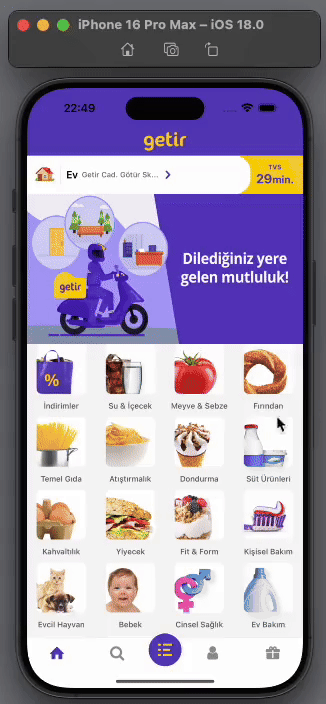

<h1>GETIR APP CLONE</h1>

I developed a clone of the Getir app using React Native. In this project, I managed data flow by utilizing Redux architecture along with Expo and React Navigation. Additionally, I enhanced the scalability of the application by implementing strong type safety with TypeScript. The user interface reflects key screens and the overall experience provided by Getir. By integrating Redux-thunk middleware and redux-logger, I strengthened state management and optimized the app's performance.

<h2> Framework </h2>

- React Native

- Expo

<h2> Libraries </h2>

- React Navigation/Native & Bottom-Tabs & Native-Stack

- Redux & Redux Thunk & React Redux

<h2> Screen Gif </h2>

